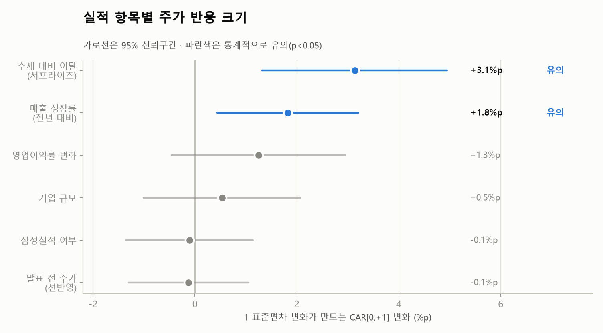
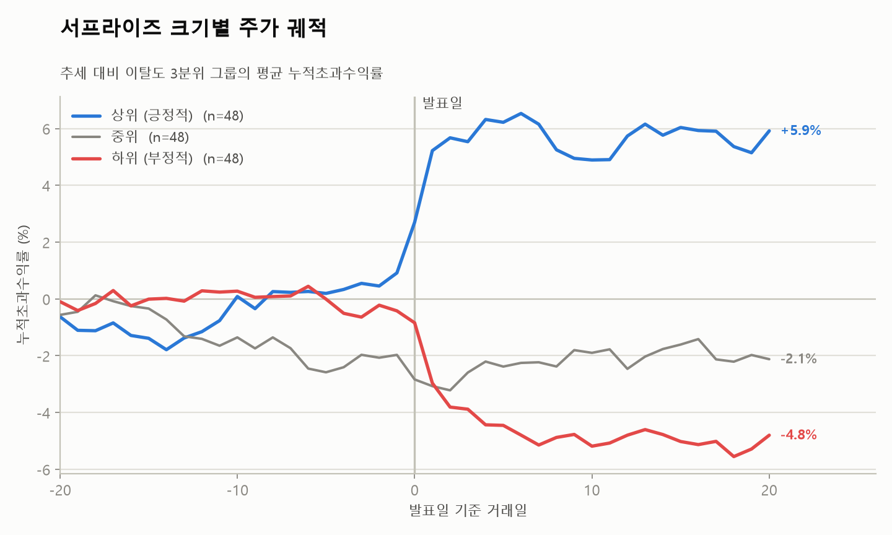
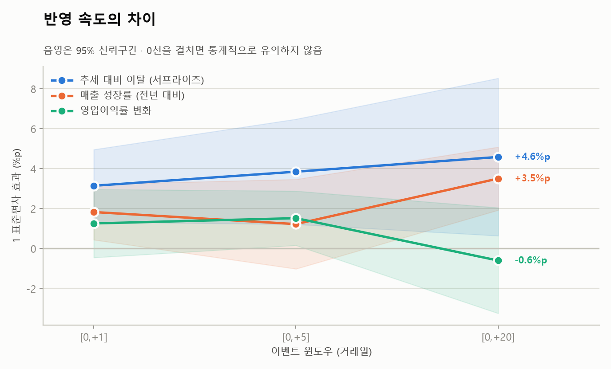
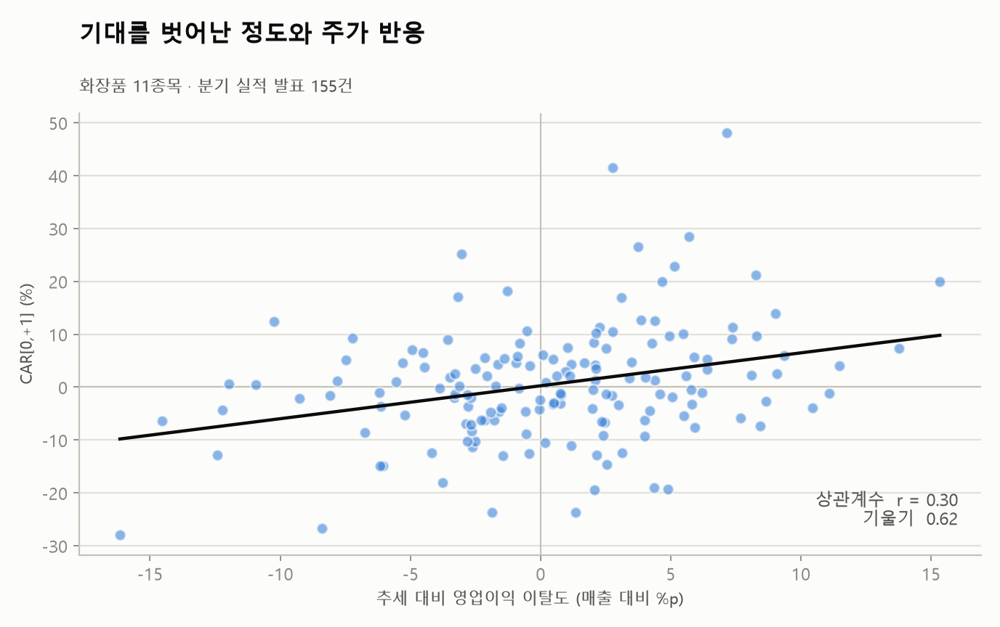

# 화장품 섹터 실적 발표와 주가 반응 분석

분기 실적 발표에 담긴 재무 항목 중 **어떤 항목이 발표 직후 주가 반응과 관련이 큰지** 분석했다.
화장품 섹터 11종목, 4년간 실적 발표 155건 대상 이벤트 스터디.

> 이 프로젝트의 중심은 모델이 아니라 **데이터 파이프라인**이다.
> 두 곳에 흩어진 데이터를 시점 정합성을 지켜 이어붙이고, 계산 결과를 검산하고,
> 그 시점에 알 수 없었던 정보가 섞이지 않게 막는 과정이 전체 작업의 대부분을 차지했다.

- 비전문가용 설명: [`docs/explainer.md`](docs/explainer.md)
- 설계·의사결정 전체 기록: [`docs/design-log.md`](docs/design-log.md)

---

## 핵심 결과

### 1. 기대 대비 이탈이 가장 강하게 관련된다



| 항목 | 1 표준편차 효과 | p값 |
|---|---|---|
| **추세 대비 이탈 (서프라이즈)** | **+3.1%p** | 0.0007 *** |
| **매출 성장률 (YoY)** | **+1.8%p** | 0.010 ** |
| 영업이익률 변화 | +1.3%p | 0.152 |
| 기업 규모 | +0.5%p | 0.501 |
| 잠정실적 여부 | −0.1%p | 0.866 |
| 발표 전 주가 (선반영) | −0.1%p | 0.832 |

`n = 155 · R² = 0.146 · 종목 군집 표준오차`

"좋은 실적"보다 **"기대보다 좋은 실적"**이 주가를 움직인다는 결과다.
컨센서스를 쓸 수 없어 과거 4분기 추세로 직접 만든 대리변수가 실제로 가장 강하게 작동했다.

### 2. 발표일에 정확히 갈라진다



서프라이즈 3분위 그룹의 평균 누적초과수익률. 발표 전까지 세 그룹이 붙어 있다가
**발표일에 급격히 갈라지고, 이후 되돌아오지 않는다.**

발표 직전이 아니라 발표일에 갈라진다는 점이 중요하다. 사전 유출이나 선반영이 아니라
발표 그 자체가 정보를 전달했다는 뜻이다.

### 3. 항목마다 반영 속도가 다르다



매출 성장률은 윈도우를 늘릴수록 계수가 커진다(+1.8%p → +3.5%p).
실적 발표 후 표류(PEAD, post-earnings announcement drift) 패턴과 일치한다.

---

## 문제 정의

실적 발표 후 주가 변동을 그냥 집계하면 세 가지 문제가 생긴다.

| 문제 | 대응 |
|---|---|
| 주가는 실적 외 요인으로도 움직인다 | 시장·섹터 수익률을 제거한 **초과수익률(CAR)** 사용 |
| 기대가 이미 반영돼 있다 | 발표 전 CAR을 통제변수로 투입, 짧은 윈도우[0,+1] 사용 |
| 개별 이벤트의 교란 요인을 통제할 수 없다 | 155건을 모아 **평균에서 상쇄** |

**무엇을 통제하고 무엇을 놔둘지의 기준**: 랜덤이면 표본 평균이 처리하도록 놔두고,
체계적이면(시장·섹터 요인, 동시 공시) 통제한다.

---

## 데이터

| 항목 | 내용 |
|---|---|
| 대상 | 화장품 섹터 11종목 |
| 기간 | 2022Q3 ~ 2026Q2 (16분기) |
| 이벤트 | 155건 |
| 실적 | DART OpenAPI (주요계정) |
| 주가 | FinanceDataReader / pykrx |
| 컨센서스 | **미사용** (사유는 아래) |

### 종목 선정 기준

> 화장품 매출이 전사 매출의 과반이고, 분석 기간 내 최소 4개 분기를 확보할 수 있는 상장사.

| 제외 | 사유 |
|---|---|
| LG생활건강, 애경산업 | 생활용품·음료 비중이 커 실적 동인이 화장품 외 요인에 좌우됨 |
| 아모레G | 아모레퍼시픽과 실적 발표 중복 (동일 이벤트 이중 계상) |
| 파마리서치, 휴젤, 클래시스 | 화장품 밸류체인 밖 (의료기기·의약품) |

섹터 정의를 협의(화장품)와 광의(K뷰티) 두 가지로 놓고 유니버스가 어떻게 달라지는지
비교한 뒤, **실적 동인의 동질성**을 기준으로 협의를 택했다.
광의로 넓히면 미용기기·톡신이 들어오는데, 이들은 실적보다 허가·소송에 주가가 반응해
"섹터를 한정한 목적" 자체가 무너진다.

---

## 전처리에서 내린 판단

### 컨센서스를 쓰지 않은 이유 — 데이터 누수

증권사 추정치(컨센서스)를 무료로 조회할 수는 있다. 그러나 화면에 보이는 값은
**오늘 기준으로 갱신된 값**이고, "2023년 3분기 발표 직전에 시장이 기대한 값"은 남아 있지 않다.

그 값을 과거 이벤트에 결합하면 **미래 정보로 과거를 설명**하게 된다 (look-ahead bias).

대신 두 가지 대리변수를 직접 만들었다.

- 과거 4분기 선형 추세로 기대치를 구성한 뒤 실제와의 편차 → **추세이탈도**
- 발표 전 20거래일 누적초과수익률 → **선반영 측정치**

같은 원칙을 모델링 단계에도 적용했다. 시계열 데이터이므로 교차검증에
일반 K-fold 대신 **`TimeSeriesSplit`**을 썼다. 무작위 분할은 미래 데이터로 과거를 예측하는
누수가 된다.

### 영업이익 성장률을 특성에서 뺀 이유

기저가 적자면 관행적인 YoY 성장률 공식이 **방향을 반대로 기록**한다.

| 사례 | 실제 의미 | `(t−t₄)/t₄` | `(t−t₄)/\|t₄\|` | 매출 대비 |
|---|---|---|---|---|
| −10억 → −20억 | 악화 | **+100%** ✗ | −100% ✓ | −1.0%p ✓ |
| −10억 → −5억 | 개선 | **−50%** ✗ | +50% ✓ | +0.5%p ✓ |
| −0.1억 → +3억 | 흑자전환 | +3100% ✗ | **+3100%** ✗ | +0.31%p ✓ |

절댓값 분모는 부호 역전만 해결하고 분모가 0에 가까울 때의 폭발은 막지 못한다.
그래서 영업이익 변화를 **매출 성장률 + 영업이익률 변화**로 분해했다.
분모가 항상 양수이고 값이 커서 두 문제가 동시에 사라지고, 해석도 선명해진다
("외형 성장인가 마진 개선인가").

### 4분기 실적을 만들고 검산한 방법

DART는 1분기·반기·3분기·연간 보고서를 제공하고 **4분기 단독 보고서는 없다.**
`연간 − 3분기 누계`로 역산했다.

역산은 틀려도 티가 나지 않으므로 **전수 검산**했다.

```
Q1 + Q2 + Q3 + Q4 == 연간   →  54개 종목·연도 전부 일치, 불일치 0건
```

### 그 밖의 처리

| 항목 | 처리 |
|---|---|
| 이벤트 정의 | 분기 실적이 **처음 공개된 날**. 잠정실적 우선, 없으면 정기보고서 |
| 중복 공시 | 같은 날 연결·별도를 모두 공시하는 기업(한국콜마) 등은 우선순위로 1건 축약 |
| 정정공시 | 제외 (원공시 존재) |
| 상장 전 이벤트 | 비상장 시기 정기보고서 제출분 제외 (에이피알 6건, 달바글로벌 3건) |
| 상장 직후 | 유통물량 부족·락업 해제 영향으로 첫 2개 분기 제외 |
| 연결/별도 | 연결 우선, 없으면 별도 폴백 (폴백 10건, `기준` 컬럼에 기록) |
| 결측 복원 | DART 계정 누락 1건을 누계 차이로 복원, 연간 검산 통과 |
| 규모 통제변수 | 이벤트 시점 시가총액을 무료로 확보할 수 없어 **동일 분기 자산총계**로 대체 |

---

## 방법

### CAR (누적초과수익률)

```
AR  = 실제 수익률 − 정상 수익률
CAR = 이벤트 윈도우 구간의 AR 합계
```

정상 수익률은 이벤트마다 모델을 자동 선택한다.

| 모델 | 적용 | 건수 |
|---|---|---|
| 2팩터 시장모델 (시장 + 섹터) | 추정 구간 확보 | 174 |
| 시장조정모델 (β=1 고정) | 상장 직후로 추정 구간 부족 | 2 |

- 추정 구간 `[-250, -30]` — 발표 직전 30일은 기대감에 오염돼 제외
- **섹터 팩터는 시장에 직교화**했다. 유니버스 동일가중 지수는 시장 움직임을 이미 포함해,
  그대로 넣으면 시장 베타가 섹터로 빨려간다(직교화 전 0.22 → 후 0.73)
- 섹터 지수는 **자기 자신을 제외**하고 구성했다
- 모델 선택은 종목 단위가 아니라 **이벤트 단위**로 판정한다

### 검증

계산된 CAR을 원본 종가로 되짚어 확인했다. 극단값은 전부 실제 거래였다.

```
실리콘투 2024Q1   t0 +29.82% → t+1 +29.95%  (상한가 2연속)
CAR[0,+1] = +48.06%
```

부수적으로 확인된 사실: **실적 발표일의 주가 변동성은 평상시의 2.03배**
(일간 수익률 표준편차 3.46% → 발표일 7.01%).

### 모형

| 모형 | 목적 |
|---|---|
| OLS (종목 군집 표준오차) | 방향과 유의성 해석 |
| Lasso (TimeSeriesSplit CV) | 변수 선택 |

같은 종목의 여러 분기 관측치는 독립이 아니므로 표준오차를 종목 단위로 군집 보정했다.

**부스팅은 쓰지 않았다.** 트리 앙상블은 변수당 관측치 50~100개가 필요해
특성 6개면 최소 400~800건이 있어야 하는데 표본이 155건이다.
게다가 주가 수익률은 신호 대비 잡음이 커서 저신호 환경에서 부스팅은 노이즈를 학습한다.
데이터에 맞지 않는 모델을 붙이는 것보다 배제 근거를 남기는 편이 낫다고 판단했다.

---

## 결과 상세

### 강건성 검증

| 변수 | 기본 | 윈저라이징 | 실리콘투 제외 | 달바 제외 | CAR[0,+5] | CAR[0,+20] |
|---|---|---|---|---|---|---|
| 매출YoY | +0.052** | +0.042*** | +0.032* | +0.052** | +0.035 | +0.099*** |
| OPM변화 | +0.227 | +0.231 | +0.255 | +0.237 | +0.275** | −0.110 |
| **추세이탈도** | **+0.576*** | **+0.544*** | **+0.493*** | **+0.545*** | **+0.705*** | **+0.840** |

추세이탈도는 모든 설정에서 유의하게 유지된다.
CAR 변동성이 가장 큰 실리콘투를 빼도 결과가 바뀌지 않는다.

### Lasso 변수 선택

```
CAR[0,+1]    추세이탈도 (0.024) > 매출YoY (0.012) > OPM변화 (0.008)
CAR[0,+5]    추세이탈도
CAR[0,+20]   추세이탈도
```

선반영·규모·정보출처 통제변수는 **모든 윈도우에서 계수가 0으로 죽었다.**
목적이 다른 두 방법(OLS·Lasso)이 같은 결론에 도달했다.

### 예상이 빗나간 것

**선반영 가설이 지지되지 않았다.** 발표 전 주가가 오른 종목은 발표 후 반응이
작을 것으로 예상했으나 계수 −0.012, p=0.83으로 사실상 0이다.

**적자 기저 대비 설계가 이 표본에서는 쓰이지 않았다.** 흑자전환 1건, 적자전환 0건으로
전환 더미를 제외했다. 11종목이 4년 내내 흑자 기조였다. 다만 영업이익 성장률을
분해한 설계 자체는 유효했고, 종목을 넓히는 v2에서는 필요해진다.



---

## 한계

1. 컨센서스 부재로 실적을 "예상된 부분 / 놀라운 부분"으로 분해할 수 없어 **계수가 과소추정**될 수 있다
2. 표본 155건으로 통계적 검정력이 제한적이다
3. 단일 섹터 분석이므로 다른 섹터로 일반화할 수 없다
4. OpenDART가 접수 시각을 제공하지 않아 장중/장후 발표를 구분하지 못했다 (CAR[0,+1] 윈도우로 흡수)
5. 규모 통제변수가 시가총액이 아닌 장부상 자산총계다
6. 일부 종목은 화장품 외 잔여 사업을 보유한다 (한국콜마 제약 CMO 등)
7. 상장 이력이 짧은 2건은 다른 모델(시장조정)로 산출됐다

---

## 확장 계획

| | 범위 | 이벤트 | 추가 분석 |
|---|---|---|---|
| **v1 (현재)** | 화장품 11종목 × 4년 | 155 | OLS + Lasso |
| v2 | K뷰티 20종목+ × 4년 | 약 320 | 유형별(브랜드/ODM/유통) 상호작용, 섹터 정의 민감도 |
| v3 | 코스피200 × 10년 | 약 8,000 | 부스팅 적용 가능 규모 |

종목 리스트와 분석 버전은 `src/config.py`에서 관리하므로 확장 시 설정만 바꾸면 된다.

---

## 재현

```bash
pip install pandas numpy statsmodels scikit-learn matplotlib pykrx finance-datareader python-dotenv
```

```bash
cp .env.example .env   # DART_API_KEY 값을 채운다
```

DART 인증키는 [opendart.fss.or.kr](https://opendart.fss.or.kr)에서 무료로 발급받는다.

```bash
cd src && for f in 0*.py 1*.py; do python "$f"; done
```

번호 순서대로 실행하면 된다. 각 단계는 중간 결과를 파일로 남기므로
뒷단에서 실패해도 앞단을 다시 수집할 필요가 없다.

---

## 파일 구조

```
├── docs/
│   ├── design-log.md            설계·의사결정·실행 기록
│   └── explainer.md             비전문가용 설명
├── src/
│   ├── config.py                공통 설정 (경로·키·기간·윈도우·종목)
│   ├── 01_check_universe.py     종목 검증
│   ├── 02_dart_corpcode.py      DART 연결 + 고유번호 매핑
│   ├── 03_fetch_disclosures.py  공시 목록 수집
│   ├── 04_build_events.py       이벤트 테이블 구성
│   ├── 05_fetch_financials.py   재무제표 수집
│   ├── 06_build_panel.py        분기 패널 구성 + 검산
│   ├── 07_fetch_prices.py       주가·지수 수집
│   ├── 08_compute_car.py        CAR 계산
│   ├── 09_validate_car.py       CAR 검증
│   ├── 10_build_features.py     특성 생성
│   ├── 11_regression.py         OLS + Lasso
│   └── 12_visualize.py          결과 시각화
├── data/                        중간·최종 산출물
└── figures/                     결과 그림
```
